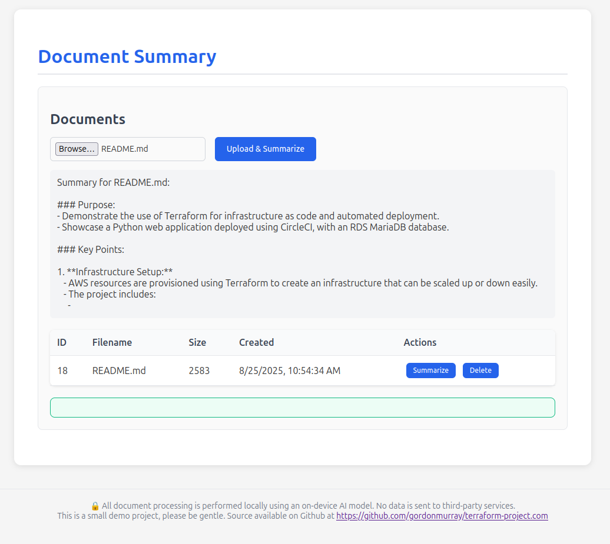

# Terraform Demo Project

A demonstration project showcasing infrastructure as code with Terraform and a Python web application deployed using CircleCI.



## Architecture

- **Infrastructure**: AWS resources provisioned with Terraform
- **Application**: Python Flask API with web frontend
- **CI/CD**: CircleCI for automated build and deployment
- **Database**: RDS MariaDB with initialization scripts

## Quick Start

### Infrastructure
```bash
cd terraform/
terraform init
terraform plan
terraform apply
```

### Application for local testing
```bash
cd app/
docker-compose up --build
```

## CI/CD Pipeline

The CircleCI pipeline handles:
- Docker image builds and ECR pushes
- Application deployment

## Project Structure

```
├── terraform/          # Infrastructure as code
├── app/                # Python application
│   ├── api/            # Flask API
│   ├── web/            # Frontend assets
│   └── db/             # Database scripts
└── .circleci/          # CI/CD configuration
```

### Estimated Cost

Using Infracost

```
──────────────────────────────────
73 cloud resources were detected:
∙ 17 were estimated
∙ 56 were free

┏━━━━━━━━━━━━━━━━━━━━━━━━━━━━━━━━━━━━━━━━━━━━━━━━━━━━┳━━━━━━━━━━━━━━━┳━━━━━━━━━━━━━┳━━━━━━━━━━━━┓
┃ Project                                            ┃ Baseline cost ┃ Usage cost* ┃ Total cost ┃
┣━━━━━━━━━━━━━━━━━━━━━━━━━━━━━━━━━━━━━━━━━━━━━━━━━━━━╋━━━━━━━━━━━━━━━╋━━━━━━━━━━━━━╋━━━━━━━━━━━━┫
┃ main                                               ┃          $253 ┃       $0.00 ┃       $253 ┃
┗━━━━━━━━━━━━━━━━━━━━━━━━━━━━━━━━━━━━━━━━━━━━━━━━━━━━┻━━━━━━━━━━━━━━━┻━━━━━━━━━━━━━┻━━━━━━━━━━━━┛
```


### Security

Using TFSec

```
67 passed, 5 ignored, 2 potential problem(s) detected.

Result #1 MEDIUM Multi-Factor authentication is not enforced for group
Result #2 LOW Instance does not have performance insights enabled.
```